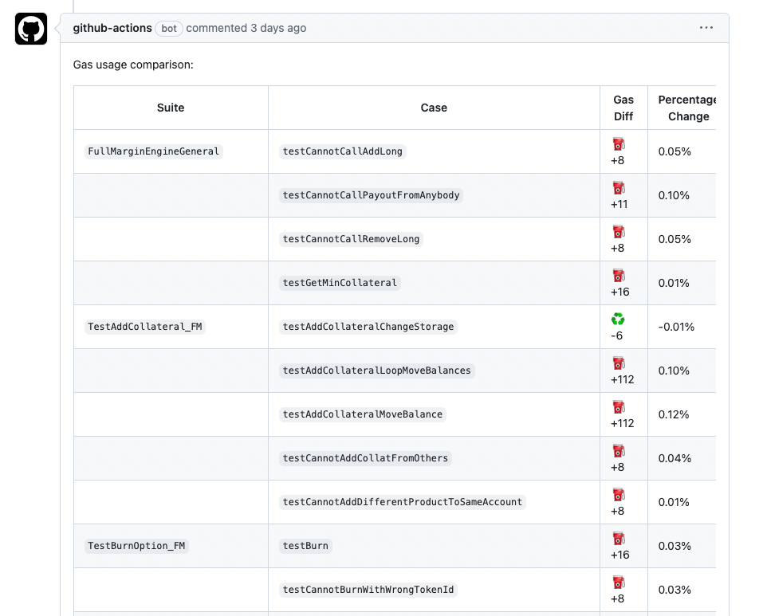

# Gas Diff Action

Gas Diff Action is a GitHub Action that compares gas usage in Solidity projects using Foundry and comments the changes on the PR.

## Preview



## Usage

To integrate Gas Diff Action into your project, follow these steps:

1. Create a `.github/workflows` directory in your repository if it doesn't already exist.
2. Inside the `workflows` directory, create a new file called `gas_comparison.yml`.
3. Add the following content to the `gas_comparison.yml` file:

```yaml
name: Gas Comparison

on:
  pull_request:
    types:
      - opened
      - synchronize

jobs:
  gas_comparison:
    runs-on: ubuntu-latest

    steps:
      - name: Run Gas Comparison
        uses: antoncoding/gas-diff-action@v2.0.1
        with:
          token: ${{ secrets.GITHUB_TOKEN }}
          base_ref: ${{ github.base_ref }}
          head_ref: ${{ github.head_ref }}
```

## Debugging

If you encounter issues with the action, particularly related to permissions, follow these steps:

1. Check the permissions of the GitHub token:
   - Go to your repository's Settings
   - Navigate to Actions > General
   - Scroll down to "Workflow permissions"
   - Ensure that "Read and write permissions" is selected for the GITHUB_TOKEN

2. Make sure your workflow file is correctly configured and the `token` input is properly set to `${{ secrets.GITHUB_TOKEN }}`.

If problems persist, please open an issue in the Gas Diff Action repository with details about the error and your configuration.

## Contributing

Contributions to Gas Diff Action are welcome! Please submit issues for bug reports or feature requests and create pull requests for any improvements or bug fixes.

## License

Gas Diff Action is released under the MIT License.